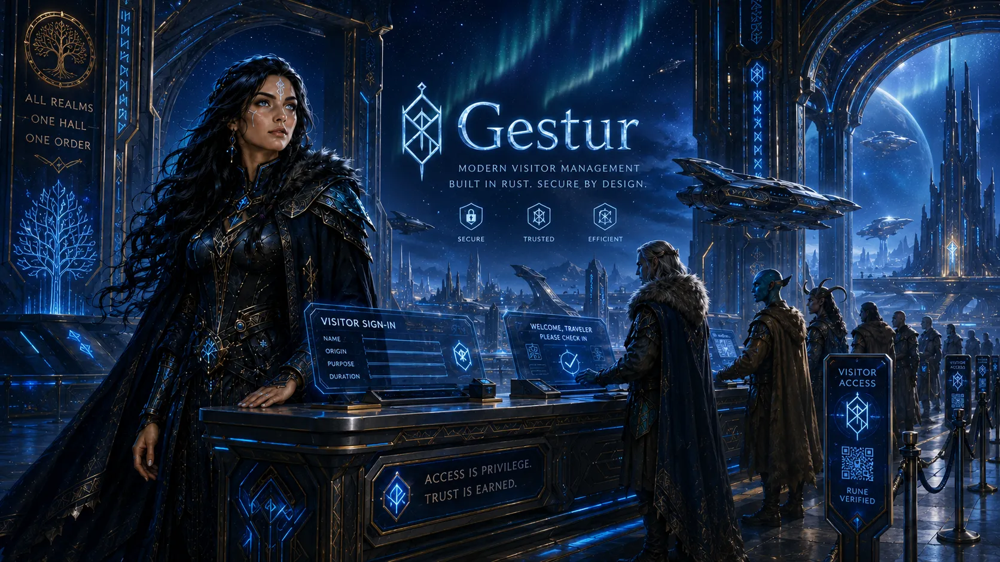

  <b>Gestur is a security-first, API-first, self-hostable visitor and guest orchestration platform.</b> 
  Typed Guest Journeys, privacy-separated identities, capability-scoped connectors,
  offline site cells, and verifiable evidence without a mandatory SaaS control plane.

  <a href="docs/IMPLEMENTATION_PLAN.md">Implementation Plan</a>
  ·
  <a href="docs/RELEASE_PLAN.md">Release Plan</a>
  ·
  <a href="docs/CRATE_PLAN.md">Crate Plan</a>
  ·
  <a href="docs/threat-model.md">Threat Model</a>
  ·
  <a href="SECURITY.md">Security</a>

 

  

# gestur

Gestur is planned as an open visitor-control platform: small enough for one
reception desk, yet architected for multi-site deployments, local hardware,
offline operation, replaceable integrations, multiple database backends, and
defensible privacy and audit evidence.

The repository is at the v0.1.0 foundation. It contains dependency-free,
no_std domain crates and repository gates. It is not yet a deployable visitor
management system and makes no production, compliance, or security-certification
claim.

Gestur is licensed under the European Union Public Licence 1.2. Every package
is private and has Cargo publishing disabled. No Gestur crate may be published
to crates.io before a separately approved public SDK policy change.

## Foundation Status

| Capability | Status | Notes |
| --- | --- | --- |
| Rust workspace | Active | Rust 1.97.1, edition 2024, resolver 3. |
| Focused crate boundaries | Active | The facade composes eight small domain/support crates. |
| no_std domain | Active | Every current Rust crate builds without std. |
| Third-party crates | None | Only workspace path dependencies exist. |
| Publish prevention | Active | Manifest inheritance and policy scripts fail closed. |
| Security baseline | Active | Threat model, supply-chain policy, CI, audit, SBOM, and pentest stop rules. |
| Platform posture | Active | Host CI for Linux, Windows, and macOS; compile gates for BSD, Android, and iOS. |
| Deployable server/UI/edge | Planned | Added incrementally by the release plan. |
| Aesynx support | Prepared | Portable core avoids OS assumptions; no current Aesynx target claim. |

## Workspace

| Crate | Role | Runtime |
| --- | --- | --- |
| gestur | Stable facade over the focused domain crates. | no_std |
| gestur-core | IDs, timestamps, revisions, and shared errors. | no_std |
| gestur-schema | Field shapes, purposes, and classifications. | no_std |
| gestur-workflow | Declarative Guest Journey nodes and transitions. | no_std |
| gestur-policy | Authorization context and named capabilities. | no_std |
| gestur-events | Attributed, sequenced domain-event envelopes. | no_std |
| gestur-api-types | Transport-neutral command and problem types. | no_std |
| gestur-crypto-types | Algorithm-agile metadata, not cryptography. | no_std |
| gestur-testkit | Deterministic test helpers. | no_std |

Infrastructure crates are introduced only when their milestone begins. Crates
are architecture and test boundaries; they do not imply one network service
per crate. See the [crate plan](docs/CRATE_PLAN.md).

## Quick Start

    cargo build --workspace
    cargo test --workspace --all-features
    scripts/checks.sh

Networked release freshness checks are separate:

    scripts/check_latest_tools.sh

The release gate stops for an independent pentest. It never publishes a crate
or creates a tag.

## Non-Negotiable Direction

- Security and privacy are design inputs from the first type.
- Core business logic stays no_std plus alloc where practical.
- Rust and tooling pins are checked against current stable releases.
- Source files may never exceed 500 lines.
- Third-party crates are prohibited unless the policy is explicitly changed
  after dependency admission; no exception is implied by this roadmap.
- PostgreSQL, MySQL, and SQLite will implement Gestur-owned semantic contracts.
- Kiosks, plugins, connectors, networks, databases, edge nodes, and AI are not
  trusted authorities.
- PII, visits, legal evidence, diagnostic logs, and security audit are separate.
- AI is optional and advisory; disabling it cannot break authoritative flows.
- Every milestone is testable, documented, pentestable, and stops before tag
  creation.
- Every behavior has unit and boundary tests. Support claims additionally
  require real-system or acceptance tests; mock-only evidence is insufficient.

## Documentation

- [Product vision](docs/PRODUCT_VISION.md)
- [Implementation plan](docs/IMPLEMENTATION_PLAN.md)
- [Release plan](docs/RELEASE_PLAN.md)
- [Crate plan](docs/CRATE_PLAN.md)
- [Engineering policy](docs/engineering-policy.md)
- [Testing policy](docs/testing-policy.md)
- [Toolchain policy](docs/toolchain-policy.md)
- [Threat model](docs/threat-model.md)
- [Security controls](docs/security-controls.md)
- [Supply-chain security](docs/supply-chain-security.md)
- [Platform support](docs/platform-support.md)
- [Publishing policy](docs/publishing-policy.md)
- [Release runbook](docs/release-runbook.md)
